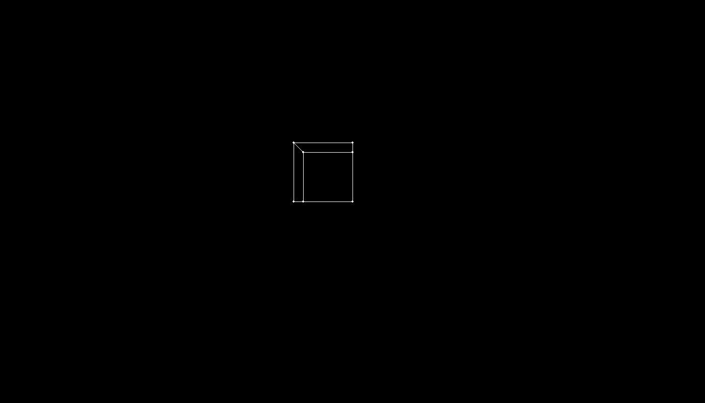

# Wireframe 3D

A software 3D wireframe renderer with custom vectors, matrices and camera projection.



## What it contains

- Perspective projection implemented directly in Python.
- A movable camera and a wireframe cube demo.
- A separate point-cloud and bounding-box experiment in experiments/point-cloud.

## Setup

Use Python 3.12. From the repository folder:

```bash
python -m venv .venv
# Windows PowerShell: .venv\Scripts\Activate.ps1
# macOS / Linux: source .venv/bin/activate
python -m pip install -r requirements.txt
python cubo.py
```

## Controls

W / S move forward / backward; A / D move sideways; left Shift / Ctrl move vertically. Hold the right mouse button to look around. Escape exits.

## Project status

An educational renderer with simple clipping; moving through the camera plane can expose projection edge cases.

Run the later experiment with `python experiments/point-cloud/cubo.py` from the repository folder. Both versions keep their original rendering approach.

## Project collection

Part of [lnivan's projects](https://github.com/lnivan), under **Simulations**.
