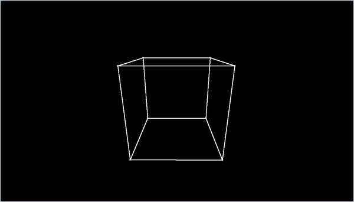

<div align="center">

# Wireframe 3D

*A software wireframe renderer in pure Python: hand-written vectors, matrices and perspective projection, plus a free-flying camera.*




</div>

## About

A small 3D renderer written from scratch on top of Pygame's 2D line drawing. It has its own vector and matrix classes, turns world points into camera space with rotation matrices, and projects them onto the screen with a pinhole-camera model. Pygame is used only for the window, input and drawing lines and dots. The demo is a wireframe cube (`cubo`) that you fly around with the keyboard and mouse. Two experiments sit in `experiments/`: a point cloud with bounding boxes, and an unfinished start of a Minecraft-style 3D game.

## Quick start

```bash
python -m pip install -r requirements.txt
python cubo.py
```

The point-cloud experiment runs the same way with `python experiments/point-cloud/cubo.py`.

## Controls

| Input | Action |
| --- | --- |
| <kbd>W</kbd> / <kbd>S</kbd> | Fly forward / backward along the view direction |
| <kbd>A</kbd> / <kbd>D</kbd> | Strafe left / right |
| <kbd>Left Shift</kbd> / <kbd>Left Ctrl</kbd> | Move up / down |
| Hold the right mouse button and move the mouse | Look around (yaw and pitch) |
| <kbd>Esc</kbd> or close the window | Quit |

## How it works

- **Hand-written linear algebra.** `Vector3` supports addition, subtraction, scaling and the dot product (written as `**`). `Matrix` multiplies by taking `VectorN` dot products of rows and columns, and treats a `Vector3` as a 1 × 3 row. NumPy is not used.
- **Camera space.** For every vertex the renderer subtracts the camera position, then undoes the camera's yaw about the z axis (`CameraZRotation`) and its pitch about the y axis (`CameraYRotation`) with two 3 × 3 rotation matrices. In camera space $x_c$ points forward, $y_c$ to the left and $z_c$ up.
- **Perspective projection.** The focal length comes from a 100° horizontal field of view across the 1400 × 800 window, about 587 px. A camera-space point is divided by its depth $x_c$:

  ```math
  f = \frac{W}{2\tan(\mathrm{FOV}/2)},\qquad (u,\,v) = \Bigl(\frac{W}{2} - f\,\frac{y_c}{x_c},\;\; \frac{H}{2} - f\,\frac{z_c}{x_c}\Bigr)
  ```

- **Lines and the cube.** `renderLine` projects both endpoints and joins them with `pygame.draw.line`, and the root renderer also marks each endpoint with a small dot. The cube is twelve hard-coded edges of the box $[10, 12] \times [0, 2] \times [0, 2]$.
- **Fly camera.** Each frame the camera moves 0.01 units (0.1 in the point-cloud experiment) along its own forward and sideways axes, which `transformVectorYZ` gets by applying the inverse of the view rotation to the unit vectors. Vertical movement is along the world z axis. While the right button is held, each pixel of mouse motion turns the camera by 0.001 rad.
- **Point-cloud experiment.** It scatters 100 random points in $[-10, 10]^3$ and draws red coordinate axes. It rotates a copy of the points by 45° about z, x and y in turn, and picks the points with the largest and smallest x, y and z in that rotated frame. It then draws twelve axis-aligned wireframe boxes (`dibujarcubo`, "draw cube") between pairs of those extreme points, and colours red every point that lies strictly inside one of the boxes. Its renderer adds per-line colours and skips points and lines behind the camera.
- **Minecraft-style fork.** An earlier copy of the engine adds `renderShape` (a closed polygon), `renderCube(center, length)`, `fillScreen`, `flipScreen` and a blocking `init()` loop. `minecraft3D.py` was meant to draw a cube at $(10, 0, 0)$ every frame as the first step of a voxel game.

## Code map

| Path | Role |
| --- | --- |
| `Engine3D.py` | Vector and matrix classes, camera state, `renderPoint` and `renderLine`. Opens the window on import. |
| `cubo.py` | The demo: input handling, camera movement and the wireframe cube |
| `experiments/point-cloud/` | July 2024 variant of both files: random point cloud, rotated-frame extremes and bounding boxes |
| `experiments/minecraft-3d/` | Earlier engine fork with cube and polygon helpers, the start of a Minecraft-style 3D game |

## Limitations

- There is no real clipping. The root renderer projects points behind the camera through the centre, so they appear mirrored, and a vertex exactly in the camera plane ($x_c = 0$) raises `ZeroDivisionError`. The point-cloud version hides points behind the camera, and drops any line with an endpoint behind the camera instead of clipping it.
- Movement is a fixed step per frame and the loop has no `Clock.tick`, so speed depends on the machine and one CPU core stays busy. `deltaTime` is computed but never used.
- Every vertex builds two new 3 × 3 matrices in pure Python each frame. This is fine for a cube but slow for bigger scenes.
- The window is fixed at 1400 × 800, the scene is hard-coded, and each script defines its own copy of `Vector3`, and all but `minecraft3D.py` also of `Matrix`.
- `experiments/minecraft-3d` does not run as it is. `minecraft3D.py` never imports `math`, so creating a vector raises `NameError`, and `Engine3D.init()` blocks until the window is closed once.
- In `experiments/point-cloud/cubo.py` the search for the smallest z compares against the point with the smallest x, so `minz` can be wrong. The script also prints the rotated points to the console as object addresses.

## Background

The renderer and the Minecraft-style fork were written in or before mid-2023, as both appear in a code backup from that time. The point-cloud experiment dates from July 2024. The project was put on GitHub in 2026.

---

<div align="center"><sub>Part of <a href="https://github.com/lnivan">lnivan's projects</a> · <b>Graphics</b></sub></div>
